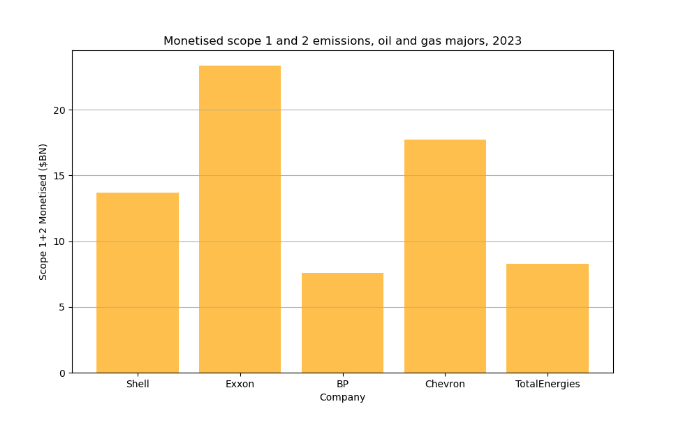
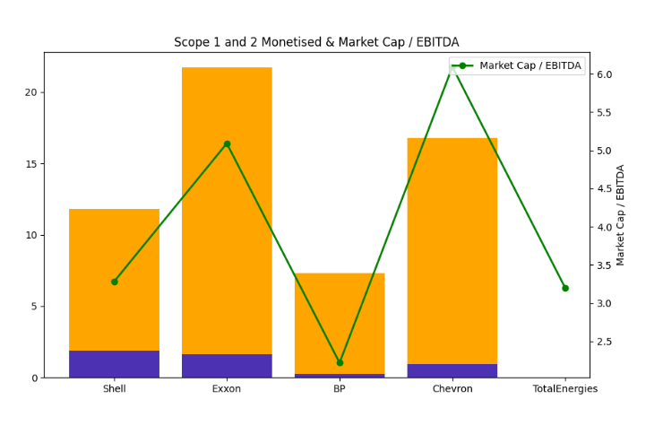
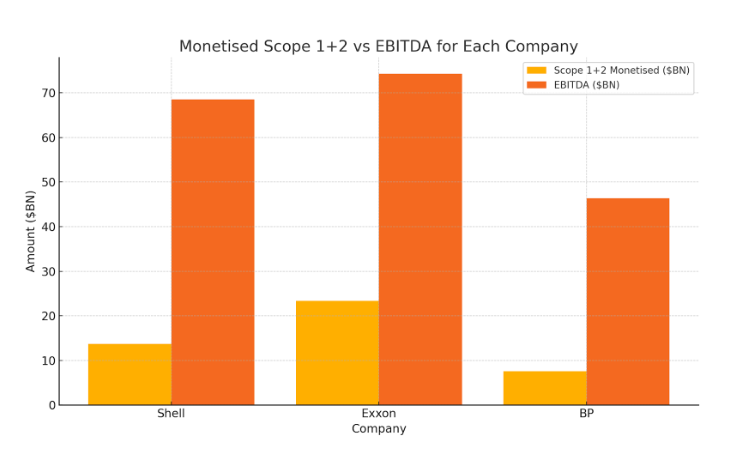
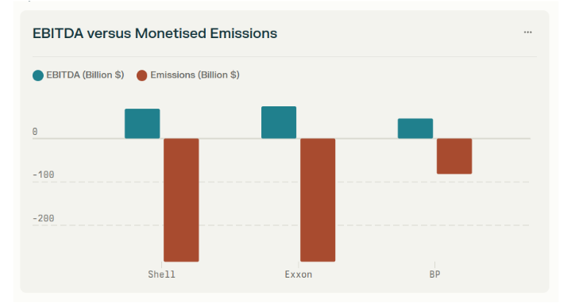

# Oil And Gas Majors - Simulated Monetised GHG Emissions

## TL:DR - Oil And Gas Isn't Pricing In Emissions Performance In 2024

To estimate the extent to which investor sentiment was correlated with the sustainability performance of major oil and gas companies, their most recent GHG emissions data was "monetised" at a social cost of carbon ($236/tonne).

Monetised emissions were plotted against market capitalisation/EBITDA for year end 2023 (with `market cap/EBITDA` being taken as a surrogate for the confidence of investors).

Concerningly, the analysis showed a *positive* correlation between the two indicators - suggesting that investor appetite is not contingent upon these companies maintaining favorable year-on-year performance in achieving sustainability targets.

Additionally:

Comparing emissions against all three reporting scopes and comparing the projected monetisations against profitability revealed a markedly different picture than when scope three emissions were excluded from analysis. 

While many oil and gas majors are able to demonstrate year on year improvements when supply chain emissions are boxed out of the equation, aggregating the three scopes reveals a broadly similar picture across the sector: monetised emissions dwarf profitability by as much as 400%.

## Data Source(s)

- [Emissions data reports](https://github.com/danielrosehill/Emissions-Data-Reports)

## Methodology

Sustainability reports for oil and gas majors were retrieved from the internet for 2023.  All data was derived directly from reporting literature released by the companies.

"Monetised" GHG emissions were computed by calculating (separately):

- Scope 1 and 2 emissions (combined)
- Scope 1, 2, and 3 emissions (combined, aggregated)

## 2023 Sustainability Reporting, Oil And Gas Majors

| Company  | Report Link |
|----------|-------------|
| Shell    | [Link](https://reports.shell.com/sustainability-report/2023/achieving-net-zero-emissions/managing-greenhouse-gas-emissions/greenhouse-gas-emissions.html) |
| BP       | [Link](https://www.bp.com/content/dam/bp/business-sites/en/global/corporate/pdfs/sustainability/group-reports/bp-sustainability-report-2023.pdf) |
| Chevron  | [Link](https://www.chevron.com/-/media/shared-media/documents/2023-sustainability-performance-data.pdf) |
| Exxon    | [Link](https://corporate.exxonmobil.com/sustainability-and-reports/metrics-and-data) |

## Monetisation At $236 tCO2e 

Emissions reporting was standardised on `mt20ce` (millions of tonnes of carbon dioxide equivalents) and calculated according the recent recommendation of the [International Foundation for Valuing Impacts](https://www.ifvi.org)-  $236/tonne (of co2 equivalents).

## Formula

Where the base unit is *millions* of tonnes of co2 equivalents the multiplier is the IFVI per-tonne rate multipled by one million:

$$
\text{Emissions (tonnes of CO}_2\text{ equivalents)} \times 236 \times 1,000,000 = \text{Monetised Emissions}
$$

## Comparative Data: Financial Performance

A positive relationship is demonstrated between monetised emissions and the market cap/EBITDA ratio: 

## When Scope 3 Is Included, Negative Monetised Emissions Eclipse EBITDA

While estimated scope 3 emissions data was not reported by all companies in the individual analysis, for those companies who made the data available (using computed emissions models), including this scope in the analysis greatly changed the picture of how their profitability sized up against their financial performance. On occasion, scope 3 data is not reported alongside scope one and two making it particularly challenging for those wishing to understand the comparative dynamics to see the joined-up picture:

## The Iceberg Effect: Scope 1, 2, 3 Emissions Dwarf Profitability

The positive green bar charts represent EBITDA ($BN) (Shell, Exxon, BP). 

The red bar charts below zero are the monetised emissions across all three scopes:

